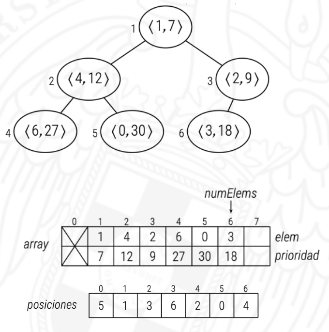

# Colas de prioridad con orden variable

Hay veces que queremos que la prioridad de los elementos cambie, para esto hace falta referirnos a los elementos que estan en la cola. Para ello vamos a usar un indice para referirnos a cada elemento de la cola.

Vamos a suponer que el numero de elementos que hay en la cola es fijo y vamos de 0 a *N* - 1 donde N es el numero de elementos de la cola.

En la imagen podemos ver como se establece la relacion en el vector de posiciones. La `posicion posiciones[0] = 5` lo que muestra que el elemento 0 esta en la quinta posicion en la pq.
