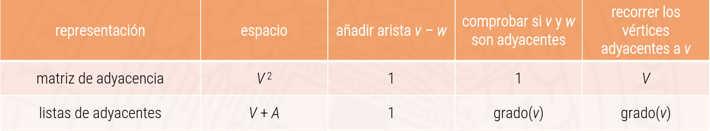

# Grafos no dirigidos

Un grafo es un conjunto de vertices y un conjunto de aristas que conectan vertices.

En general los nombres de los vertices no son importantes pero hay que poder distinguirlos. Para ello los numeramos de 0 a *V* - 1; donde *V* es el numero de vertices.

## El TAD grafo

El tad grafo tiene las siguientes operaciones:

``` c++
Grafo(int V) // Crea un grafo vacio con V vertices
void ponArista(int v, ont w) // añade una arista entre los vertices v y w
Adys ady(int v) const // consulta los adyacentes a un vertice (aquellos vertices que esta conectado a v)
int V() const // consulta el numero de vertices
int A() const // consulta el numero de aristas
```

### Representacion de los grados no dirigidos

#### Matriz de adyacencia

Basa la representacion en una matri *V*x*V* de booleanos que tiene la componente `matrix[v][w] = true` si hay una arista entre los vertices *v* y *w* y `false` en caso contrario.

Para recorrer los vertices tenemos una complejidad en tiempo de O(V) siendo v el numero de vertices del grafo. Un recorrido tipico seria:

``` c++
int grado(Grafo const &g, int v){ // O(V)
        int grado = 0;
        for (int w : g.ady(v))
                ++grado;
        return grado;
}
```

Para obtener el numero de aristas de un grafo habria que ir recorriendo todos los vertices del grafo y obtener su grado y / 2 (ya que para cada *v*-*w* hay 2 entradas en la matriz). Por lo tanto recorrer los vertices adyacente a *v* esta en O(V).

``` c++
int aristas(Grafo const& g) { // O(V²)
        int aristas = 0;
        for (int v = 0; v < g.V(); ++v)
                aristas += grado(g, v);
        return aristas / 2;
}
```

La complejidad en espacio adicional seria de O(V²) ya que para cada vertice *v* tendriamos entradas.

#### Lista de adyacencia

La otra idea seria tener una lista de adyacencia que para cada vertice *v* guardamos que vertices *w* son adyacentes a el. Por lo general los grafos suelen ser dispersos y nos interesa recorrer los vertices adyacente a un vertice dado por lo tanto vamos a usar mas la representacion con una Lista de adyacencia.

Las funciones arriba expestuas serian las siguiente con las complejidades indicadas:

``` c++
int grado(Grafo const &g, int v){ // O(grado(v))
        int grado = 0;
        for (int w : g.ady(v))
                ++grado;
        return grado;
}
```

``` c++
int aristas(Grafo const &g){ // O(V + A)
        int grado = 0;
        for (int v = 0; v < g.V(); ++v)
                ++grado;
        return grado;
}
```



### Implementacion de grafos no dirigidos con listas de adyacencia

``` cpp
using Adys = std::vector<int>; // lista de adyacentes a un vértice
class Grafo {
private:
        int _V; // número de vértices
        int _A; // número de aristas
        std::vector<Adys> _ady; // vector de listas de adyacentes
public:
        Grafo(int V) : _V(V), _A(0), _ady(_V) {}
        int V() const { return _V; }
        int A() const { return _A; }
        
        void ponArista(int v, int w) {
                if (v < 0 || v >= _V || w < 0 || w >= _V)
                        throw std::domain_error("Vertice inexistente");
                ++_A;
                _ady[v].push_back(w);
                _ady[w].push_back(v);
        }

        Adys const& ady(int v) const {
        if (v < 0 || v >= _V)
                throw std::domain_error("Vertice inexistente");
        return _ady[v];
        }
};
```

## Patron de diseño para procesamiento de grafos

El objetivo es separar la representacion del grafo de la solucion. Para cada problema sobre grafos que vayamos a resolver, debemos crear una clase especifica **problema**.

Pongamos pcomo ejemplo que tenemos un grafo y un vertice origen *s* y qqueremos determinar con que otros vertices esta conectado *s*. Creariamos una clase **conexion.cpp** de la siguiente manera:

``` cpp
class Conexion {
        public:
                Conexion(Grado const &g, int s); // busca los vertices conectados a s
                bool conectado(int v) const; // esta v conectado a s
                int cuantos() const; // Cuantos verices estan conectados a s
};

void resuelve(Grafo cont &g, int s){
        Conexion conex(g,s);
        cout << "Vertices conectado a s " << s << ":";
        for(int v = 0; v < g.V(); ++v){
                if(v != s && conex.conectado(v))
                        cout << " " << v;
        }
        cout << '\n';

        if(conex.cuantos() != g.V()) cout << "no ";
        cout << "es conexo\n";
}
```
