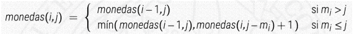

# Problema del cambio de monedas

≝
> Un sistema monetario M = { m1, m2, … , mn } de tipos de monedas, donde cada mi es un número natural.
>
> ∃ una cantidad ilimitada de monedas de cada valor
>
> Se quiere pagar una cantidad *C* > 0 utilizando el menor numero de monedas posible.

- Una estrategia voraz no funciona ya que ordenariamos las monedass de mayor a menor valor e iriamos cogiendo monedas hasta llegar hasta nuestro *C*.

  - Si nuestro sistema monetario es canonico (las monedas mas grandes son multiplos de las pequeñas) un algoritmo voraz encontrara una solucion optima al problema.
  *i.e.* {1,5,10,25} queremos pagar 24 => 2 monedas de 10, 4 monedas de 1.
  - Si nuestro sistema monetario no es canonico un algoritmo voraz no encontrara la solucion optima
  *i.e.* {1,3,4} queremos pagar 6 =>
    - 1 moneda de 4 y 2 de 1 (solucion voraz).
    - 2 monedas de 3 (solucion optima)

## Planteamiento dinamico para el problema del cambio

La solucion es plantear un multiconjunto de monedas. POdemos fijar el orden en el que vamos considerando los tipos de monedas, sin que esto afecte al resultado final

`monedas(i, j) = numero minimo de monedas para pagar la cantidad j considerando los tipos de monedas del 1 al i`

Vamos a considerar un definicion recursiva del problema:

**CASOS BASE:**

- monedas(i, 0) = 0  : 0 <= i <= n
- monedas(0, j) = +∞ : 1 <= j <= C

**CASOS RECURSIVOS:**



1. Si el valor de la moneda es mayor que la cantidad a pagar, vemos si se puede pagar con la siguiente moneda mas pequeña
2. Si el valor de la moneda es menor o igual que la cantidad a pagar:
    - No usar la i-ésima moneda, en cuyo caso el número de monedas necesarias es monedas(i-1, j)
    - Usar al menos una i-ésima moneda, en cuyo caso el número de monedas necesarias es 1 + monedas(i, j-mi), donde mi es el valor de la i-ésima moneda
    - Nos quedamos con el minimo de los dos valores asi asegurando el menor numero de monedas posibles

*i.e* Para pagar la cantidad *C*=8 y M = {(m1 = 1), (m2 = 4), (m3 = 6)} acabariamos con una tabla como la siguiente

|   |  0  |  1  |  2  |  3  |  4  |  5  |  6  |  7  |  8  |
|---|-----|-----|-----|-----|-----|-----|-----|-----|-----|
| **0** |  +∞ | +∞  |  +∞ | +∞  |  +∞ | +∞  |  +∞ | +∞  |  +∞ |
| **1** |  0  |  1  |  2  |  3  |  4  |  5  |  6  |  7  |  8  |
| **2** |  0  |  1  |  2  |  3  |  1  |  2  |  3  |  4  |  2  |
| **3** |  0  |  1  |  2  |  3  |  1  |  2  |  1  |  2  |  2  |

## Implementacion del problema

``` c++
vector<int> devolver_cambio(vector<int> const& M, int C) {
  int n = M.size();
  vector<EntInf> monedas(C+1, Infinito);
  monedas[0] = 0;
  // calcular la matriz sobre el propio vector
  for (int i = 1; i <= n; ++i) {
    for (int j = M[i-1]; j <= C; ++j) {
      monedas[j] = min(monedas[j], monedas[j - M[i-1]] + 1);
    }
  }
  vector<int> sol;
  if (monedas[C] != Infinito) {
    int i = n, j = C;
    while (j > 0) { // no se ha pagado todo
    if (M[i-1] <= j && monedas[j] == monedas[j - M[i-1]] + 1) {
      // tomamos una moneda de tipo i
      sol.push_back(M[i-1]);
      j = j - M[i-1];
    } else // no tomamos más monedas de tipo i
      --i;
    }
  }
  return sol;
}

```
