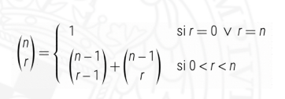
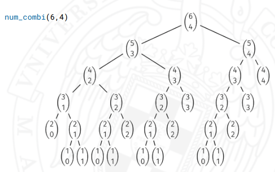
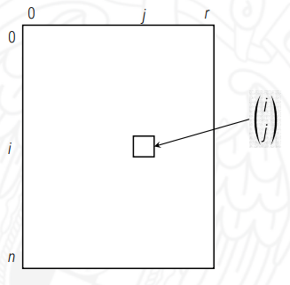
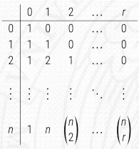

# Programacion Dinamica

Vamos a empezar viendo el concepto de numeros combinatorios. Los numeros combinatorios plasman de cuantas maneras se pueden coger un subconjuntos de *r* elementos de un conjunto de *n* elementos distintos.

{: style="height: 49%"}

## Implementacion recursiva

La implementacion recursiva resulta bastante obvia ya que teniendo la definicion recursiva del problema obtenemos el siguiente codigo

``` c++
int num_combi(int i, int j) {
  if (j == 0 || j == i) return 1;
  else return num_combi(i-1, j-1) + num_combi(i-1, j);
}
```

No obstante si desplegamos las llamadas recursivas se puede observar rapidamente que el problema tiene mucho solapamiento de subproblemas.



## Planteamiento con programacion dinamica

En vez de resolver varias veces problema que ya hemos resuelto antes usemos una tabla, un array multidimensional en este caso, para almacenar los resultados de subroblemas ya resueltos.

- La tabla tiene tantas dimensiones como argumentos tiene la recurrencia (2 en este caso)
- El tamaño de cada dimension coincide con los valores que puede tomar el argumento correspondiente
- Cada subproblema se asocia a una posicion de la tabla

Por lo tanto un planteamiento dinamico del problema de los numeros combinatorios generaria una tabla de soluciones de la siguiente manera (asumiendo que *n* y *r* son lo mismo que arriba definido):



### Programacion dinamica descendente (top-down)

Tambien conocida como memoization.

- Mantiene el diseño recusivo
- La funcion recibe como paramentro de I/O la tabla de soluciones
- Antes de resolver de manera recursiva un problema se comprueba que no este ya resuelte en la tabla de soluciones
- Tras resolver un subproblema recursivo se almacena su solucion en la tabla
- ∃ necesidad de saber si un subproblema esta resuelto o no

Una implementacion descendente del problema de numeros combinatorios podria ser la siguiente:

``` c++
template <typename T>
using t_matrix = vector<vector<T>>;

int main(){

  /*
    Inicializamos la matriz de (n + 1) x (r + 1) a -1 ya que vamos a usar el -1
    como indicador de que el subproblema no esta resuelto. Si vale cualquier otro 
    valor sabemos que esta resuelto. Elegimos el -1 porque con n, r ∈ Numeros Naturales
    nCr no puede tomar un valor negativo. 
  */
  int n = 6;
  int r = 4;
  t_matrix<int> C(n + 1, r + 1, -1);
  cout << num_combi(6, 4, C) << '\n';
  cout << num_combi(5, 4, C) << '\n';
  cout << num_combi(4, 3, C) << '\n';
  cout << num_combi(4, 4, C) << '\n';
}

/*
  La complejidad en tiempo es de O(n x r) ya que cada subproblema tiene una complejidad de O(i x j).

  La complejidad en espacio es de O(n x r) ya que se usa una tabla de n x r.
*/
int num_combi(int i, int j, t_matrix<int> & C) {
  if (j == 0 || j == i) // Caso base
    return 1;
  else if (C[i][j] != -1) // ∃ solucion al problema en la tabla de soluciones
    return C[i][j];
  else { 
    /* 
      ∄ solucion al problema en la tabla de soluciones ∴ resolvemos el
      problema recursivamente
    */
    C[i][j] = num_combi(i - 1, j - 1, C) + num_combi(i - 1, j, C); 
    return C[i][j];
  }
}
```

### Programacion dinamica ascendente (bottom-up)

Tambien conocido como tabulation.

- Cambiamos el orden en el que se resuelven los subproblemas
  - Comenzamos resolviendo todos los subproblemas mas pequeños que se puedan necesitar para despues combinarlos hasta llegar a resolver el problema original
- Los subproblemas se van resolviendo recorriendolos de menor a mayor tamaño
- Todos los posibles subproblemas de tamaño menor tienen que ser resueltos antes de resolver uno de mayor tamaño

Teniendo en cuenta que la matrix es un espejo sobre la diagonal la matriz de solucion de subproblemas tiene la siguiente forma:



Con lo anterior en mente una implementacion inicial del problema podria ser la siguiente:

``` c++
template <typename T>
using t_matrix = vector<vector<T>>;

int main(){
  int n = 6;
  int r = 4;
  cout << num_combi(6, 4) << '\n';
}

/*
  La complejidad en tiempo es de O(n x r) ya que cada subproblema tiene una complejidad de O(i x j).

  La complejidad en espacio es de O(n x r) ya que se usa una tabla de n x r.
*/
int num_combi(int n, int r) {
  t_matrix<int> C(n + 1, r + 1, 0);
  C[0][0] = 1;
  for(int i = 1; i <= n; ++i){
    C[i][0] = 1; // por definicion anterior
    for(int j = 1; j <= r; ++j){
      C[i][j] = C[i - 1][j - 1] + C[i - 1][j]; 
    }
  }
  return C[n][r];
}
```

La solucion anterior tiene una mejor posible. Se puede observar que solo usamos la fila acutal y anterior para calcular el numero combinatorio, de esta manera podemos reducir el tiempo en espacio de O(n x r) a O(r). Para mantener la exactitud deberiamos actualizar el vector de manera inversa.

``` c++
int main(){
  int n = 6;
  int r = 4;
  cout << num_combi(6, 4) << '\n';
}

/*
  La complejidad en tiempo es de O(n x r) ya que cada subproblema tiene una complejidad de O(i x j).

  La complejidad en espacio es de O(n x r) ya que se usa una tabla de n x r.
*/
int num_combi_optimised(int n, int r) {
    vector<int> C(r + 1, 0); 
    C[0] = 1; // Por definicion anterior
    for (int i = 1; i <= n; ++i) {
        for (int j = std::min(i, r); j >= 1; --j) { // Reverse order update
            C[j] = C[j - 1] + C[j];
        }
    }

    return C[r];
}
```
