# Arboles AVL

Son arboles de busqueda binarios con una codicion de equilibrio: Todos los nodos del arbol cumples que la diferencia de alturas de sus 2 hijos es como mucho 1. Por esto la altura de una arbol AVL con N nodos esta en O(log N).

## Autoequilibrado

La insecion o borrado de un nodo puede provocar que deje de cumplirse la condicion de equilibrio.

### Rotaciones simples

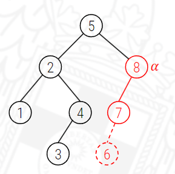

En este caso podemos ver como la insercion de un 6 provocaria un desequilibrio en el nodo α ya que tendria una altura de 0 en el nodo derecho y 2 en el nodo izquierdo. Al tener un desequilibrio en el hijo izquierdo vamos solucionar este problema se emplea una rotacion simple a la derecha entonces nos quedariamos con el siguiente arbol

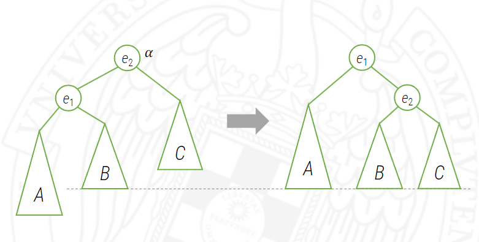{: style="width: 49%"} 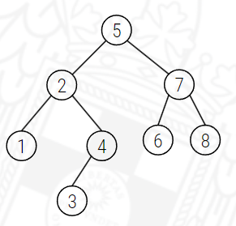{: style="width: 49%"}

En el caso que ocurra al insertar y que se desiquilibre el arbol a la derecha como en la siguiente imagen tendremos que solucionar haciendo una rotacion simple a la izquierda.

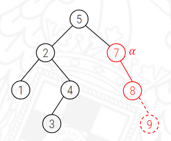

Como se ha comentado mas arriba ahora se ha desequilibrado por la derecha el nodo α. La rotacion a la izquierda seria de la siguiente manera:

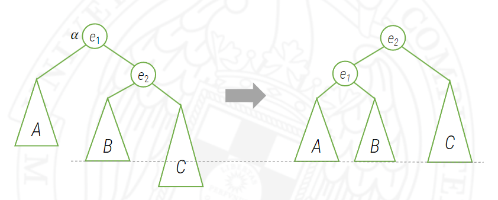{: style="width: 49%"} 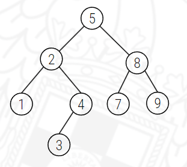{: style="width: 49%"}

### Rotaciones dobles

#### Rotacion doble izquierda-derecha

Hay casos en que las rotaciones simples no son suficientes, por ejemplo si tenemos el siguiente arbol y queremos insertar un 7 vemos que se inserta en el hijo derecho del nodo 6.

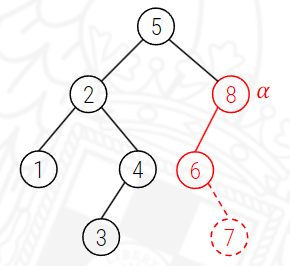

Rotamos para la izquierda y despues para la derecha => dejamos un arbol parecido al arbol que teniamos con el desequilibrio por rotacion por la izquierda.

Despues de esto rotamos para la derecha para que el arbol acabe de manera equilibrada

{: style="width: 49%"} 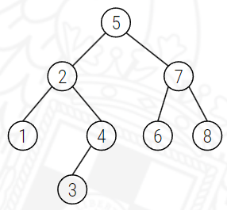{: style="width: 49%"}

#### Rotacion doble derecha-izquierda

En el siguiente caso queremos insertar el 8 en el hijo derecho del nodo 9

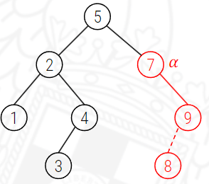
Rotamos para la izquierda y despues para la derecha => dejamos un arbol parecido al arbol que teniamos con el desequilibrio por rotacion por la izquierda.

Despues de esto rotamos para la derecha para que el arbol acabe de manera equilibrada

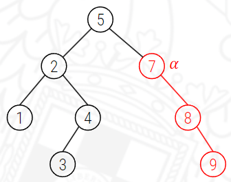{: style="width: 49%"} 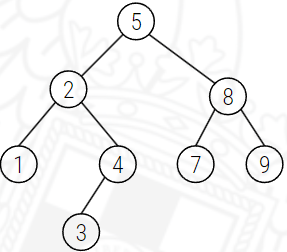{: style="width: 49%"}
